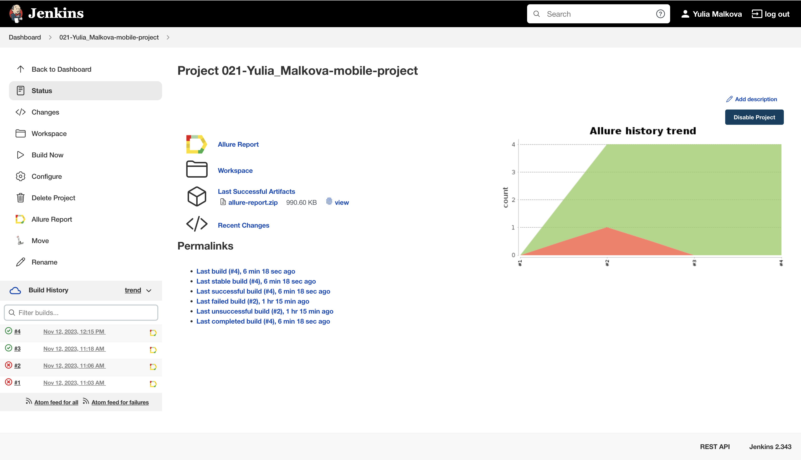
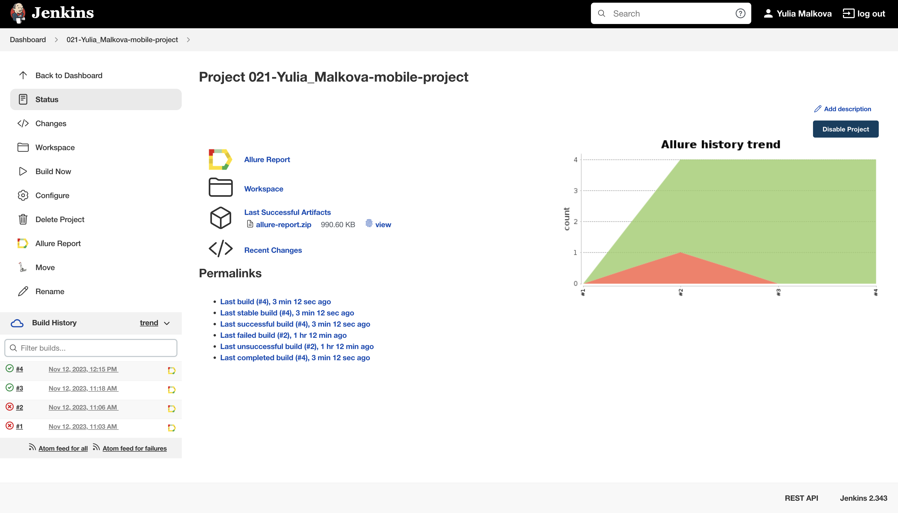
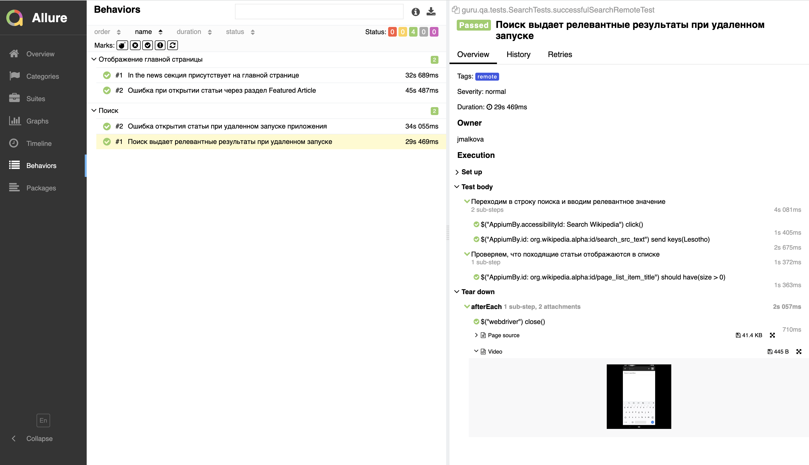
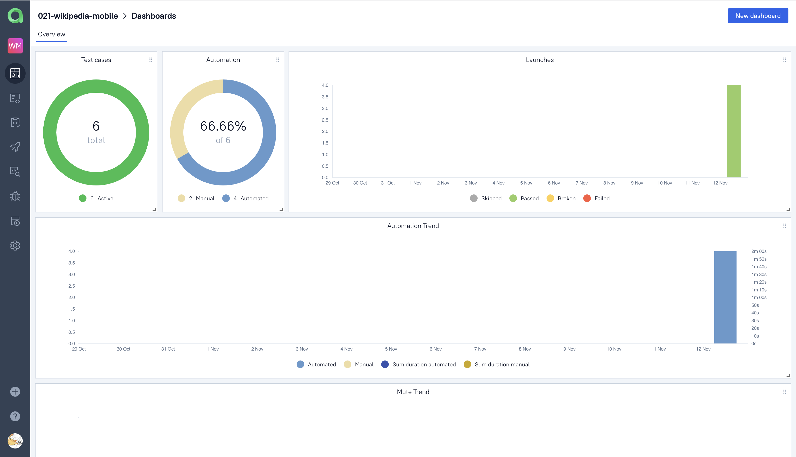
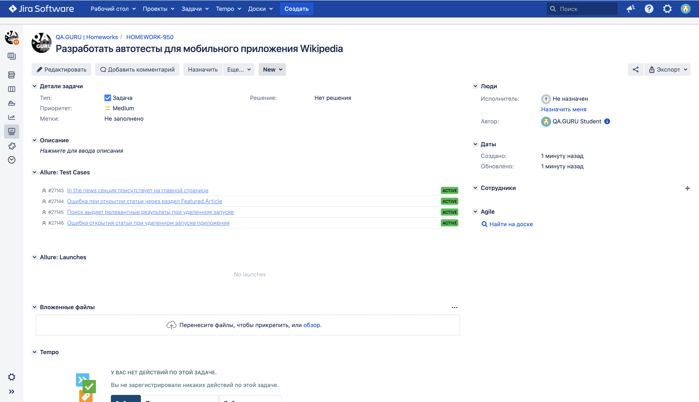
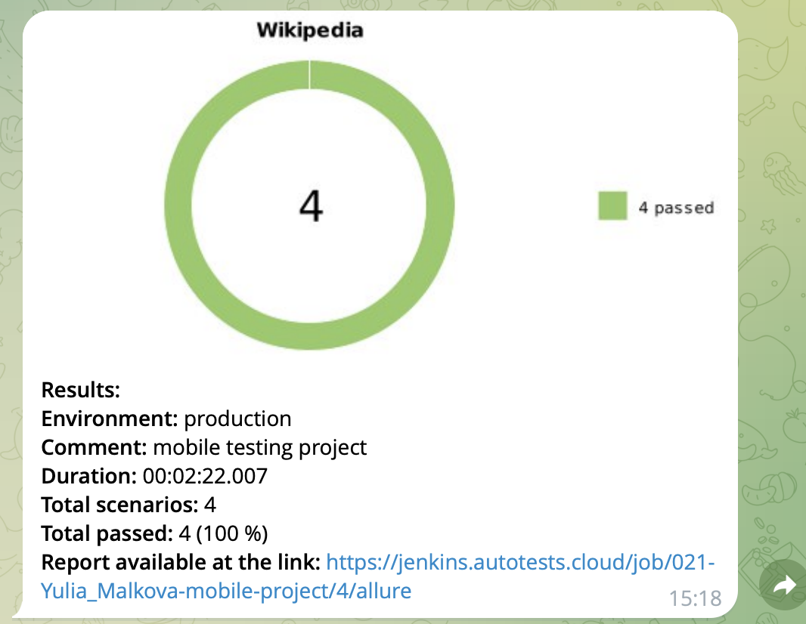

<p align="center">
<a href="https://github.com/wikimedia/apps-android-wikipedia">  </a></h1>
<p align="center">

# <p align="center"> Проект по автоматизации тестовых сценариев для  мобильного приложения <a href="https://github.com/wikimedia/apps-android-wikipedia/">Wikipedia</a></h1> <p align="center">

## Технологии и инструменты:
<p align="center">
<a href="https://www.jetbrains.com/idea/"></a>
<a href="https://www.java.com/"></a>
<a href="https://github.com/allure-framework"></a>
<a href="https://qameta.io/"></a>
<a href="https://gradle.org/"></a>
<a href="https://junit.org/junit5/"></a>
<a href="https://github.com/"></a>
<a href="https://www.jenkins.io/"></a>
<a href="https://web.telegram.org/"></a>
<a href="https://www.atlassian.com/software/jira/"></a>
<a href="https://www.browserstack.com/"></a>
<a href="https://appium.io/"></a>
</p>

- В данном проекте автотесты написаны на языке <code>Java</code> с использованием фреймворков <code>Rest Assured</code> и <code>JUnit 5</code>.
- В качестве сборщика был использован - <code>Gradle</code>.
- Использованы <code>Appium</code> и <code>BrowserStack</code> для локального/удаленного запуска приложения на мобильном устройстве.
- Для удаленного запуска реализована джоба в Jenkins с формированием Allure-отчета и отправкой результатов в <code>Telegram</code> при помощи бота.
- Осуществлена интеграция с <code>Allure TestOps </code> и <code>Jira</code>.

## Реализованные проверки
### При запуске локально (local) на эмуляторе:

- Проверка 4 страниц онбоардинга
- Проверка добавления языка на первом экране онбоардинга
- Проверка появления результатов поиска при выдаче
- Проверка открытия статьи, найденной через поиск
- Проверка добавления статьи в папку "Cохраненное"

### При запуске удаленно (remote) на Browserstack:

- Проверка появления результатов поиска при выдаче
- Проверка открытия статьи, найденной через поиск
- Проверка отображения карточки "In the news" на главной странице
- Проверка открытия статьи через карточку Featured Article на главной странице
  
## Запуск автотестов

### Запуск локально (local) на эмуляторе:

```bash  
gradle clean local_test -DdeviceHost=local
```
> Внимание! Для запуска локальных тестов на компьютере должны быть установлены Android Studio, Appium Server и Appium

### Запуск удаленно (remote) на Browserstack:

```bash  
gradle clean remote_test -DdeviceHost=remote
```
> Для запуска необходимо нажать "Build now"


## Сборка в [Jenkins](https://jenkins.autotests.cloud/job/021-Yulia_Malkova-mobile-project/)
<p align="center">

</p>

## Пример [Allure-отчета](https://jenkins.autotests.cloud/job/021-Yulia_Malkova-mobile-project/allure/)
### Overview

<p align="center">

</p>

### Результат выполнения теста

<p align="center">

</p>

## Интеграция с [Allure TestOps](https://allure.autotests.cloud/project/3778/dashboards)

Выполнена интеграция сборки <code>Jenkins</code> с <code>Allure TestOps</code>.
Результат выполнения автотестов отображается в <code>Allure TestOps</code>
На Dashboard в <code>Allure TestOps</code> отображена статистика пройденных тестов.

<p align="center">

</p>

## Интеграция с [Jira](https://jira.autotests.cloud/browse/HOMEWORK-950)

Реализована интеграция <code>Allure TestOps</code> с <code>Jira</code>, в тикете отображается информация, какие тест-кейсы были написаны в рамках задачи и результат их прогона.

<p align="center">

</p>

## Уведомления в Telegram с использованием бота

После завершения сборки, бот созданный в <code>Telegram</code>, автоматически обрабатывает и отправляет сообщение с результатом.

<p align="center">

</p>
